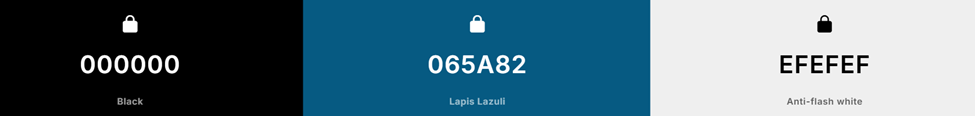

# Årsoggave 2025 Streaming servise

## Beskrivelse
Jeg lager en streaming service. Den er inspirert av lingnenede sider som Netflix eller Disney+ og skal ha en fungerende database som kan brukes til å logge inn en kunde i nettsiden. 

## Verktøy
Verktøyene jeg har brukt er:
- HTML CSS for nettside oppsett og generell styling.  
- JavaScript for en interaktiv nettside. 
- Flask i Python for å hoste databasen min og nettsiden til bruk på andre pc-er.
- RasberryPi som database hvor du skal kunne legge til brukere.

### Farger
Jeg har valgt disse fargene for å få den blåe fargen til å se bra ut i både dark og ligt modus.

## Universiell utforming
Jeg har valgte å ha en dark mode på nettsiden min for og kunne skape en berde opplevelse for alle. 
For personer som har migrener kan det hjelpe å ikke ha en helt hvit skjerm. Det er en button så brukeren kan selv velge hva de liker best.