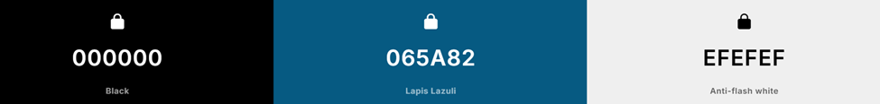

# Årsoppgave 2025 

## Beskrivelse
Det er et nettsted for bilder, som ligner litt på pintrest. Den skal ha en fungerende database der man kan opprette en bruker og logge inn.

## Verktøy
Verktøyene jeg har brukt er:
- HTML CSS for oppsett av nettside og generell styling.  
- JavaScript for en interaktiv nettside. 
- Flask i Python for å hoste databasen min og nettsiden til bruk på andre pc-er.
- RasberryPi som database hvor du skal kunne legge til brukere.

### Farger
Jeg har valgt disse fargene for å få den blå fargen til å se bra ut i både dark og light modus.

## Universiell utforming
Denne nettsiden har en dark mode som utgjør en bedre opplevelse for brukeren. For personer som har migrene kan det hjelpe å ikke ha en helt hvit skjerm. Det er en button så brukeren kan selv velge hva de foretrekker.

### Målgruppe
Målgruppen er ungdom og unge voksne i alderen 13 til 25 år, med interesse for fotografi og illustrasjoner.